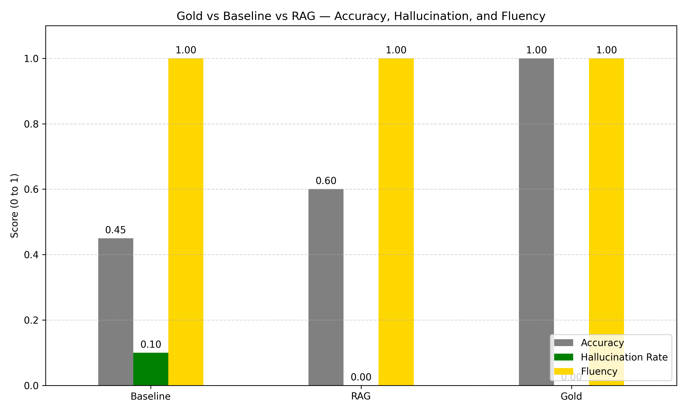

# Retrieval-Augmented QA over Ghanaian Health Policy Documents

This project implements a Retrieval-Augmented Generation (RAG) system to answer questions over Ghanaian public health policy documents. It combines dense vector retrieval with language model reasoning to support more accurate, grounded, and fluent answers from long, fragmented policy documents published by Ghana’s Ministry of Health.

---

## Motivation

Ghana’s health policy documents are extensive but difficult to query directly. Important guidelines on the use of antibiotics, malaria treatment, or healthcare waste,are buried in long PDF reports that are not structured for search or question answering.

This project applys Retrieval-Augmented Generation (RAG) to build a smarter QA system grounded in official documents. It supports domain-specific queries like:

> “What is Ghana’s protocol for treating malaria in the first trimester?”  
> “What does the national health policy say about medical waste disposal?”

---

## Project Design

The system was designed with multiple research-focused components:

### Data Collection

- Scraped **36 government-issued PDFs** from [moh.gov.gh](https://moh.gov.gh/)
- Filtered out corrupted or scanned documents using automated word count checks

### Chunking Experiments

Three chunking strategies were implemented and logged:

1. **Fixed 300-word windows**
2. **Overlapping windows (300 words, 100-word stride)**
3. **Sentence-based segmentation (via NLTK)**

All chunk logs and statistics were saved for later retrieval quality comparison  
 Only **word300** was used in the current evaluation phase

### QA Pipeline

- Built a FAISS index using `sentence-transformers (MiniLM)`
- Used Hugging Face's `flan-t5-base` to:
  - Generate baseline answers (no context)
  - Generate RAG answers using retrieved top-3 chunks
- Truncated token input to avoid overflow (max 480 tokens total)

### Evaluation

- Manually extracted **10 gold QA pairs** from the document corpus
- Scored both baseline and RAG responses on:
  - Accuracy
  - Hallucination
  - Fluency

All results saved and visualized.

---

## Results

| Metric            | Baseline | RAG  | Gold |
| ----------------- | -------- | ---- | ---- |
| **Accuracy**      | 0.45     | 0.60 | 1.00 |
| **Hallucination** | 0.10     | 0.00 | 0.00 |
| **Fluency**       | 1.00     | 1.00 | 1.00 |

> Retrieval-Aware generation increased factual accuracy by 33% and eliminated hallucinated answers, while preserving fluency.

---

## Repository Structure

```
ghana-health-policy-rag-qa/
├── ghana_rag_pipeline.ipynb             # Full pipeline: chunking, generation, evaluation
├── data/
│   ├── gold_qa.jsonl
│   ├── baseline_qa_results.jsonl
│   ├── rag_qa_results.jsonl
│   ├── rag_chunks_word300.jsonl
│   └── chunking_log_word300.csv
├── visuals/
│   └── performance_vs_gold_chart.png
├── requirements.txt
└── README.md

```

---

## Visual Summary



---

## Built With

- [FAISS](https://github.com/facebookresearch/faiss)
- [Hugging Face Transformers](https://huggingface.co/docs/transformers)
- [Sentence-Transformers](https://www.sbert.net/)
- [NLTK](https://www.nltk.org/) (for sentence chunking)
- [Matplotlib / Pandas](https://pandas.pydata.org/) for logging and visualization

---

## Future Work

- Evaluate **chunking strategy impact** (sentence vs overlap vs word300) on retrieval recall and answer quality
- Expand gold QA pairs to 50+ manually verified examples
  -Apply to multilingual health policy QA (Twi, Pidgin, French)
- Try hallucination-aware models (e.g., Llama Guard, GPT-4 Turbo with citations)
- Package as an interactive search tool for Ghanaian health researchers

---

## Author Notes

## Project Context

This repository is part of my independent research portfolio exploring retrieval-augmented QA for real-world documents. It focuses on factual accuracy and usability in health policy contexts, particularly in Ghana.

For collaboration or feedback, feel free to get in touch.

````

```

```
````
